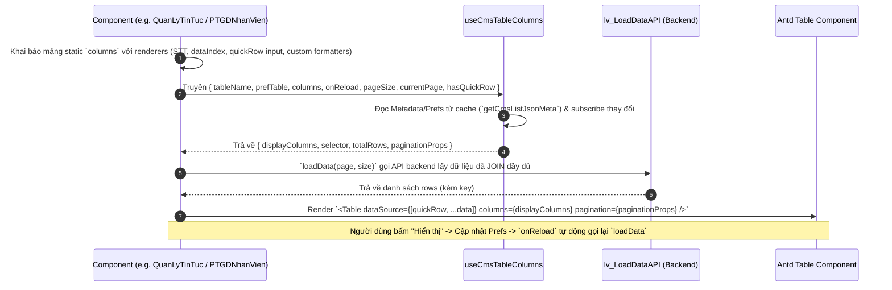

# Kế Hoạch Đồng Bộ Kiến Trúc Load Dữ Liệu Mặc Định & Tự Động Hiển Thị ("Hiển Thị") Cho Module Nhân Sự

## 1. Phân Tích Kiến Trúc Chuẩn Từ `QuanLyTinTuc.jsx` (Metadata Hướng Dẫn FE)

### Core Principle (Nguyên tắc cốt lõi)
1. **Load dữ liệu mặc định đầy đủ (Fully Joined Data):**
   - API Backend chịu trách nhiệm query và join đầy đủ thông tin từ các bảng liên quan (ví dụ: `lv002_name` cho danh mục tin tức, `tennv` cho mã nhân viên, `tenquanhe` cho mã quan hệ, `tentiente` cho mã tiền tệ).
   - Component Frontend luôn load toàn bộ cấu trúc dữ liệu join này thông qua hàm `loadData()` bằng `lv_LoadDataAPI`.

2. **Vai trò của Chức Năng "Hiển Thị" (`useCmsTableColumns`):**
   - Chức năng "Hiển thị" (`useCmsTableColumns` + `ColumnSelector`) chỉ đóng vai trò **hướng dẫn giao diện** (UI Guide / Dynamic View Preferences).
   - Nó quyết định cột nào ẩn/hiện, thứ tự sắp xếp cột (orderList), số dòng trên trang (`maxRows`), và trang hiện tại (`curPage`), mà **KHÔNG** làm hạn chế hay can thiệp vào logic join dữ liệu của API backend.

3. **Luồng Xử Lý Chuẩn (Step-by-Step Data Flow):**

---

## 2. Các Bước Xử Lý Chi Tiết Cho Khung Sườn Đồng Bộ (Standard Implementation Blueprint)

### Bước 1: Khai báo Cấu hình Cột Tĩnh (`columns`)
- Khai báo mảng `columns` tiêu chuẩn (bao gồm cột `stt`, các cột dữ liệu `dataIndex`, `title`, `width`, `align`, `fixed`, và hàm `render`).
- Trong hàm `render`, kiểm tra `record.isQuickRow` để trả về Input/Select thêm nhanh, hoặc render giá trị đã được join sẵn (ví dụ: `record.tennv`, `record.tenquanhe`).

### Bước 2: Tích hợp Hook `useCmsTableColumns`
- Gọi `useCmsTableColumns` với đối số truyền vào gồm:
  - `tableName`: Mã bảng dữ liệu (ví dụ `hr_lv0026`).
  - `prefTable`: Mã bảng lưu preference (ví dụ `hr_lv0026`).
  - `columns`: Mảng cột tĩnh đã định nghĩa ở Bước 1.
  - `requiredKeys`: Danh sách key bắt buộc không cho phép ẩn (ví dụ `['lv001']`).
  - `onReload`: Hàm callback reload dữ liệu khi đổi trang, đổi maxRows hoặc lưu tùy chọn preference.
  - `hasQuickRow`: `true` nếu có dòng nhập nhanh.
- Hook sẽ tự động tính toán `displayColumns`, `selector`, `totalRows`, và `paginationProps`.

### Bước 3: Hàm Tải Dữ Liệu (`loadData`)
- Sử dụng `useCallback` định nghĩa `loadData(page, size)` gọi API lấy dữ liệu đã JOIN.
- Cập nhật state `data` với `key` duy nhất cho mỗi dòng.
- Gọi `loadData()` trong `useEffect` khi mount hoặc khi điều kiện lọc/tìm kiếm thay đổi.

### Bước 4: Render Toolbar & Bảng Dữ Liệu
- Toolbar chuẩn hóa bao gồm:
  - Icon & Tiêu đề module.
  - Nút Thao tác: **Thêm**, **Sửa**, **Xóa**, **Làm mới**, **Xuất file** (Excel/Word/Web).
  - Phân vùng bên phải toolbar chứa đếm số dòng đã chọn & `{cmsTableColumns.selector}`.
- Bảng Antd `<Table>`:
  - `columns={cmsTableColumns.displayColumns}`
  - `dataSource={[{ isQuickRow: true, key: '__QUICK_INSERT__' }, ...data]}`
  - `pagination={cmsTableColumns.paginationProps}`

---

## 3. Đồng Bộ Component `PTGDNhanVien.jsx` (Chuẩn Module Nhân Sự)

### Các điểm cần sửa đổi trong `PTGDNhanVien.jsx`:
1. **Loại bỏ sự trùng lặp Hook:** `PTGDNhanVien.jsx` hiện đang gọi cả `useBackendColumnManager` lẫn `useCmsTableColumns` thủ công, làm rối luồng `displayColumns` và `paginationProps`. Chuyển sang sử dụng **duy nhất `useCmsTableColumns`** như `QuanLyTinTuc.jsx`.
2. **Khai báo `columns` trực tiếp & gọn gàng:** Chuyển `defaultColumns` + `displayColumns` rối rắm thành một mảng `columns` duy nhất chứa đầy đủ logic render (xử lý `isQuickRow`, tooltip, formatted date, joined text).
3. **Đồng bộ Toolbar & Nút Export:** Đồng bộ thanh Toolbar compact, nút Xuất file (Excel, Word, Web popup tab mới), nút Làm mới, Sửa, Xóa và đưa `cmsTableColumns.selector` về vị trí chuẩn bên phải.
4. **Đồng bộ Pagination & Table Props:** Sử dụng trực tiếp `cmsTableColumns.paginationProps` để quản lý phân trang đồng bộ với backend preference (`maxRows`, `curPage`).

---

## 4. Proposed Changes (Thay Đổi Cụ Thể Trong `PTGDNhanVien.jsx`)

#### [MODIFY] [PTGDNhanVien.jsx](file:///c:/Users/Theanh/SOF/QLNS/SOF_ERP/src/pages/NhanVien/PTGDNhanVien.jsx)
- Cấu trúc lại mảng `columns` chuẩn.
- Sử dụng hook `useCmsTableColumns` duy nhất.
- Cập nhật `loadData` đồng bộ với `onReload` của hook.
- Chuẩn hóa Toolbar, Xuất file (Word/Excel/Web tab mới), và Table pagination.

---

## 5. Kế Hoạch Kiểm Tra (Verification Plan)

### Automated/Build Verification
- Kiểm tra syntax JS/JSX và linter không phát sinh lỗi.
- Đảm bảo ứng dụng React biên dịch bình thường.

### Manual Verification
- Kiểm tra hiển thị bảng `PTGDNhanVien` với dòng thêm nhanh (Quick Row).
- Kiểm tra tính năng "Hiển thị" (nút bánh răng / ColumnSelector): Ẩn/hiện cột, đổi thứ tự cột, thay đổi số dòng/trang.
- Kiểm tra tính năng Xuất file Excel, Word, và xem dạng Web (tab mới).
- Kiểm tra tính năng Thêm nhanh, Thêm qua Drawer, Sửa, Xóa.
