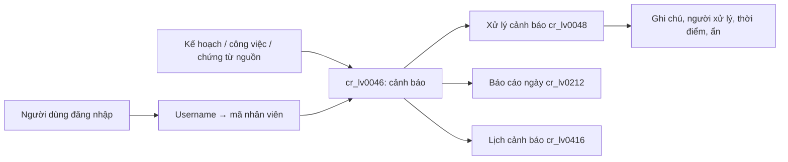

# Báo cáo phân tích module Cảnh báo SOF ERP

## Phạm vi và kết luận

Đã đối chiếu module Cảnh báo của hệ thống cũ `soferp` với giao diện React mới và API PHP mới.

Module quản lý vòng đời của một cảnh báo công việc: tạo thủ công hoặc tự động, giao cho người tiếp nhận, theo dõi thời hạn/chu kỳ, xử lý hoặc ẩn, lập báo cáo ngày và biểu diễn theo lịch.

Nguyên nhân chính khiến hệ thống mới hiển thị sai là **nhầm định danh đăng nhập với mã nhân viên**. Các bản ghi `cr_lv0046` và các liên kết tới `hr_lv0020` dùng mã nhân viên (`hr_lv0020.lv001`), nhưng API mới vẫn tạo lớp `cr_lv0046`, `cr_lv0048`, `cr_lv0212`, `cr_lv0416` với `LV_UserID` là username. Do đó dữ liệu được tạo/được lọc với username, trong khi các truy vấn join và danh sách nhân viên kỳ vọng mã nhân viên.

## Bản đồ menu và vai trò các trang

| Menu cũ | Mã | Vai trò nghiệp vụ | Thành phần mới |
|---|---:|---|---|
| Cảnh báo | `cr_lv0046` | Danh sách nguồn; tạo/sửa/xóa cảnh báo, theo chu kỳ. | `CanhBao` |
| Xử lý cảnh báo | `cr_lv0048` | Hộp xử lý cá nhân, tính số ngày tới hạn, ghi chú, ẩn và chuẩn bị email. | `XuLyCanhBao` |
| Báo cáo cảnh báo hàng ngày | `cr_lv0212` | Báo cáo theo khoảng ngày, nhân viên/phòng ban và quyền quản lý. | `BaoCaoCanhBaoHangNgay` |
| Lịch cảnh báo theo tháng | `cr_lv0416` | Ma trận nhân viên × ngày để quan sát cảnh báo theo lịch. | `LichCanhBaoTheoThang` |

## Mô hình dữ liệu nghiệp vụ

`cr_lv0046` là bảng trung tâm. Ý nghĩa các trường được sử dụng trong module:

| Trường | Ý nghĩa |
|---|---|
| `lv001` | Mã cảnh báo. |
| `lv002` | Kế hoạch/dự án, liên kết `cr_lv0004.lv001`. |
| `lv003` | Công việc, liên kết `cr_lv0005.lv001`. |
| `lv004` | Mã loại/module nghiệp vụ, liên kết `cr_lv0003.lv001`; ví dụ `TTLH`, `BBG`, `PBH`. |
| `lv005` | Mã tham chiếu tại module nguồn. Với `BBG` lấy từ `sl_lv0010.lv014`; với `PBH` lấy từ `sl_lv0013.lv115`; các loại khác hiện tra kế hoạch. |
| `lv006` | Ngày cảnh báo/hiệu lực bắt đầu. |
| `lv007` | Ngày hết hạn hoặc mốc xử lý. |
| `lv008` | Số ngày/khoảng thời gian phục vụ điều kiện email; giao diện hiện đặt mặc định `0`. |
| `lv009` | Nội dung cảnh báo. |
| `lv010` | Cờ dừng cảnh báo (`1`: dừng; `0`: hoạt động). |
| `lv011`, `lv012` | Mã nhân viên và thời điểm dừng cảnh báo. |
| `lv013` | Người tạo cảnh báo — **mã nhân viên**. |
| `lv014` | Ngày tạo. |
| `lv015` | Cờ cảnh báo phát sinh tự động. |
| `lv016` | Người tiếp nhận cảnh báo; hỗ trợ nhiều mã nhân viên, phân tách bằng dấu phẩy. |
| `lv017` | Chu kỳ: `0` ngày, `1` tuần, `2` tháng, `3` năm; lịch còn xử lý giá trị `4`. |
| `lv089` | Cờ ẩn/đã xử lý trong hộp xử lý. |

## Luồng nghiệp vụ tổng thể



1. Người có quyền tạo khai báo cảnh báo trong `cr_lv0046`, chọn kế hoạch, công việc, loại/module, tham chiếu, ngày cảnh báo, hạn, chu kỳ, người tiếp nhận và nội dung.
2. Một số tiến trình tự động cũng sinh/cập nhật cảnh báo: liên hệ (`TTLH`), báo giá (`BBG`) và phiếu bán hàng (`PBH`). Trước khi tạo, hệ thống kiểm tra cảnh báo trùng theo loại + tham chiếu + người nhận; nếu đã có thì cập nhật nội dung/trạng thái thay vì tạo trùng.
3. Người tạo/chủ sở hữu mở `cr_lv0048` để thấy cảnh báo của mình, ưu tiên bản ghi gần hạn. Họ dừng hoặc ẩn cảnh báo sau khi xử lý/gửi email.
4. Quản lý xem `cr_lv0212` theo khoảng ngày, nhân viên và phòng ban mà quyền cho phép.
5. `cr_lv0416` dựng lịch theo người nhận và ngày, bao gồm cảnh báo theo chu kỳ còn hiệu lực trong khoảng đã chọn.

## Chi tiết theo màn hình

### 1. Cảnh báo — `cr_lv0046`

**Hệ thống cũ.** Trang cha tính số lượng theo năm tab: ngày, tuần, tháng, năm và tổng hợp. Khi người dùng không đồng thời có quyền duyệt/không duyệt, danh sách được giới hạn theo `lv013 = LV_UserID`. Trang con hỗ trợ CRUD, lọc, xuất/in và quyền theo cấu hình lớp.

**Sinh tự động.** `LV_TTLH_Alarm`, `LV_XuLy_GGB`, `LV_XuLy_PGH` quét nghiệp vụ nguồn rồi gọi `LV_InsertAuto` hoặc `LV_InsertAutoID`. Bản ghi tự động lưu `lv015`; `LV_InsertAutoID` cho phép chỉ định người tạo vào `lv013`.

**Hệ thống mới.** React có tab chu kỳ, tìm kiếm, phân trang, chọn cột, thêm nhanh và Drawer CRUD. API `LoadCanhBaoJSON` còn gọi `LV_TTLH_Alarm()` khi có quyền thêm, sau đó lọc và trả nhãn lookup.

**Đã khắc phục.** API tạo mới luôn ghi `lv013 = mã nhân viên đăng nhập`; giao diện chọn người tiếp nhận ở `lv016`. Thao tác Dừng cảnh báo cập nhật đồng thời `lv010`, `lv011` và `lv012`.

### 2. Xử lý cảnh báo — `cr_lv0048`

Tên lớp lịch sử gây nhiễu: lớp `cr_lv0048` thao tác trên `cr_lv0046`, không phải một bảng xử lý riêng.

Danh sách tính `lv990 = DATEDIFF(lv007, CURRENT_DATE())`, sắp tăng dần để bản ghi quá hạn/gần hạn lên đầu. Bộ lọc `lv089` tách đang hiển thị và đã ẩn. Dừng cảnh báo cập nhật `lv010`, `lv011 = LV_UserID`, `lv012 = now()`; thao tác ẩn chỉ đổi `lv089`.

Soạn email chỉ dựng nội dung từ các bản ghi được chọn còn trong điều kiện thời hạn. “Gửi mail” hiện **không gửi qua mail server**: nó chỉ ghi lịch sử `SendMail` (nếu hàm lịch sử hoạt động) và đặt `lv089=1`. Giao diện đang đặt tên nút “Gửi mail”, dễ gây hiểu nhầm là thư đã được gửi.

### 3. Báo cáo cảnh báo hàng ngày — `cr_lv0212`

Trang cũ nhận khoảng ngày, nhân viên, phòng ban và tùy chọn tháng. Nếu không có toàn quyền duyệt, báo cáo bị thu hẹp về người dùng hiện tại; nếu có quyền duyệt thì mở rộng theo cây phòng ban trả về từ `Get_User(...)`. SQL báo cáo lọc trên người tiếp nhận (`A.lv013`) và/hoặc phòng ban của nhân viên đó.

React mới hiện chỉ gửi `dateFrom`, `dateTo`, từ khóa và phân trang. API vẫn hỗ trợ `employeeId/lv013` và `depId`, nhưng giao diện chưa cung cấp hai bộ lọc này; do đó chưa tái hiện đủ luồng quản lý của trang cũ.

### 4. Lịch cảnh báo theo tháng — `cr_lv0416`

Tên menu là “theo tháng”, nhưng màn hình cũ mặc định hiển thị cửa sổ 11 ngày (hôm nay ±5 ngày) và cho người dùng thay đổi khoảng ngày. Hệ thống tạo cột ngày và hàng nhân viên, rồi đặt cảnh báo vào ô tương ứng.

Điều kiện lấy cảnh báo:

- Chu kỳ `0`: `lv006` nằm trong khoảng ngày.
- Chu kỳ `1..4`: lấy khi hạn `lv008` chưa kết thúc theo điều kiện cũ (đang dùng so sánh với `dateto`).
- Có thể giới hạn theo phòng ban, cây phòng ban hoặc nhân viên.

React mới tái hiện ma trận và Drawer chi tiết khá đúng. Tuy nhiên UI mới mới gửi khoảng ngày; chưa gửi `depId` hoặc `employeeId`, dù API hỗ trợ. Đặc biệt, do join `A.lv013 = hr_lv0020.lv001`, cảnh báo có `lv013` là username sẽ không vào lịch.

## Phân tích lỗi định danh người dùng

### Quy tắc đúng trong hệ thống mới

| Khái niệm | Giá trị | Dùng cho |
|---|---|---|
| Username đăng nhập | `$class->LV_UserID` ngay sau khởi tạo | Xác thực/tài khoản. |
| Mã nhân viên thực tế | `Get_EmployeeID_ByUser($username)` | Chủ sở hữu cảnh báo, người nhận, lọc nhân sự, join `hr_lv0020`. |

Quy tắc chuyển đổi cần áp dụng ngay khi khởi tạo lớp nghiệp vụ cảnh báo:

```php
$username = $class->LV_UserID;
$employeeId = $class->Get_EmployeeID_ByUser($username);
if (!empty($employeeId)) {
    $class->LV_UserID = $employeeId;
}
```

Nên tách thêm biến `$username` nếu cần audit theo tài khoản. Không dùng username thay cho mã nhân viên ở các trường `lv013`, `lv011`, `lv016` hoặc tham số lọc nhân sự.

### Điểm cần sửa trên API

Trong `services.sof.vn/index.php`, hàm `lv_current_employee_id()` đã tồn tại nhưng chưa được gán cho các lớp của bốn case cảnh báo. Cần gán mã nhân viên ngay sau khi `new`:

| API case | Hệ quả hiện tại | Điều chỉnh |
|---|---|---|
| `cr_lv0046` | Tạo mới ghi sai `lv013`; list cá nhân có thể rỗng. | `$mocr_lv0046->LV_UserID = lv_current_employee_id();` |
| `cr_lv0048` | Không thấy cảnh báo của mình; `lv011` ghi username. | Gán mã nhân viên trước load/update/email. |
| `cr_lv0212` | Báo cáo cá nhân và cây phòng ban tra bằng username. | Gán mã nhân viên trước `LoadBaoCaoCanhBaoNgayJSON`. |
| `cr_lv0416` | Lọc lịch/cây phòng ban và `A.lv013` sai. | Gán mã nhân viên trước `LoadLichCanhBaoThangJSON`. |

`lv_current_employee_id()` đang là phương án dùng lại phù hợp vì nó áp dụng đúng `Get_EmployeeID_ByUser()` như endpoint `getCurrentUser`.

## Các chênh lệch hiển thị/chức năng cần xử lý tiếp

1. **Mã hóa tiếng Việt:** nội dung UI/API hiển thị trong mã nguồn dưới dạng lỗi kiểu `Cảnh báo`. Cần chuẩn hóa file UTF-8 (không BOM theo cấu hình dự án) và HTTP `charset=utf-8`; nếu không, tiêu đề/thông báo sẽ sai dù dữ liệu đúng.
2. **Số lượng ở tab:** hệ thống cũ hiển thị số lượng của từng chu kỳ; UI React đã nhận `summary` nhưng chưa hiển thị số liệu này trên tab.
3. **Quyền và nút thao tác:** API trả `permissions` nhưng UI chưa dùng để ẩn/khóa đúng CRUD theo `GetView/GetAdd/GetEdit/...`.
4. **Bộ lọc báo cáo:** cần bổ sung nhân viên và phòng ban ở `BaoCaoCanhBaoHangNgay` để khớp hệ thống cũ.
5. **Bộ lọc lịch:** cần bổ sung nhân viên và phòng ban ở `LichCanhBaoTheoThang`.
6. **Người tiếp nhận khi thêm:** cần chốt quy tắc. Nếu cảnh báo thủ công luôn thuộc người tạo, bỏ/khóa trường chọn người nhận để tránh hiểu lầm. Nếu được giao cho người khác, API phải dùng `lv013` đã chọn sau khi kiểm tra quyền; không để `LV_Insert()` ghi đè vô điều kiện.
7. **Gửi email thật:** đổi nhãn thành “Đánh dấu đã gửi/ẩn” cho tới khi tích hợp mail server; hoặc tích hợp dịch vụ email và chỉ đặt `lv089=1` sau khi gửi thành công.
8. **Điều kiện chu kỳ của lịch:** điều kiện hiện dùng `lv008` như mốc kết thúc trong khi giao diện mô tả trường này là số ngày. Cần xác nhận schema/ý nghĩa nghiệp vụ thực tế trước khi thay đổi, vì đây có thể là nguồn sai lệch dữ liệu lịch.

## Thứ tự khắc phục khuyến nghị

1. Chuẩn hóa `LV_UserID` về mã nhân viên ở cả bốn API case, rồi kiểm thử bằng tài khoản username khác mã nhân viên.
2. Quyết định quy tắc giao người nhận và sửa nhánh insert cho phù hợp.
3. Khôi phục các bộ lọc nhân viên/phòng ban, hiển thị số lượng tab và áp dụng quyền UI.
4. Chuẩn hóa mã hóa tiếng Việt.
5. Chốt cơ chế email và kiểm thử các cảnh báo sinh tự động/chạy định kỳ.

## Tệp đã đối chiếu

- Hệ thống cũ: `C:\laragon\www\soferp\soft\cr_lv0046\cr_lv0046.php`, `cr_lv0048\cr_lv0048.php`, `cr_lv0212\cr_lv0212.php`, `cr_lv0416\cr_lv0416.php` và các lớp tương ứng trong `C:\laragon\www\soferp\clsall`.
- Giao diện mới: `C:\Users\Theanh\SOF\QLNS\SOF_ERP\src\pages\QuanLyCongViec\CanhBao\CanhBaoModules.jsx`.
- API mới: `C:\laragon\www\v2.des.erp.banhangonline.top\services.sof.vn\index.php` và các lớp tương ứng trong `C:\laragon\www\v2.des.erp.banhangonline.top\clsall`.
